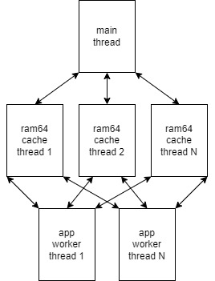

# ram64

[](https://nodei.co/npm/ram64/) [](https://app.travis-ci.com/asilvas/ram64)

Multi-threaded 64bit memory cache database inspired by Redis-like features. Currently only supports **nodejs**, but
could potentially support **deno** and **web** in the future.




## Use cases

Below examples are good use cases for `ram64`:

* Heavy compute workloads that must span many worker threads & processor cores
* Share memory/state across many worker threads
* `Map` key requirements that exceed the 2^24 limits of **V8**
* Exceptionally large memory requirements
* Atomic operations that span many worker threads
* Dynamic atomic operations that span many worker threads


## Anti patterns

Below examples are sub-optimal use cases for `ram64`:

* Need to share state across multiple processes or servers
* All your work can be done on the main thread
* Key requirements fit into a single `Map`


## Performance

Depending on your hardware and number of worker threads, throughput can
range from 100K operations/sec to many millions of operations/sec. Per
operation latency is typically in the low microseconds, `10us` (`0.010ms`)
range. Under heavy congestion latencies can exceed `50us`.

Throughput is typically much higher than most
out-of-process service like Redis (unless using a large many-node cluster).
Results vary by workloads, but [benchmark results](tools/bench/results.json)
show upwards of 10x higher throughput with `ram64`.

Run `npm run bench` for a comprehensive look at throughput on your hardware,
as well to contrast Redis on same hardware and comparable operations.


## Basic usage

Creating a `ram64` instance is only permitted on the main thread, and is
as simple as:

```
import { startup } from 'ram64';

const ram64 = await startup();
```

Of course we can perform any operation from the main instance, but for
best performance you'll want to spawn your own workers and connect to the
main instance like so:

```
// main.js
import { Worker } from 'worker_threads';
import { startup } from 'ram64';

const ram64 = await startup();
const worker = ram64.spawnWorker('./worker.js');
// optionally you can spawn your own worker and
// invoke `ram64.registerWorker(worker)` instead
```

```
// worker.js
const { workerData } = require('worker_threads');
const { connect } = require('ram64');

connect(workerData.connectKey).then(async ram64 => {
    await ram64.set('hello', 'world');
    const world = await ram64.get('hello');
});
```


## Exports

* `startup(StartupOptions): Promise<RAM64>` - Create a new `RAM64` instance.
  * `StartupOptions.threadCount` (default: `CPU_CORES`) - Number of dedicated
    cache workers to spread load/shards over. Tunable based on your usage, but
    default should generally suffice.
  * `StartupOptions.shardCount` (default `4096`) - The default is typically
    sufficient to handle any memory requirements of 2TB and beyond.
  * `StartupOptions.maxMemory` - By default **LRU Eviction**
    is not enabled. You must specify a `maxMemory` threshold (in bytes) in
    order for **LRU Eviction** to maintain the desired memory usage across
    the entire process.
* `connect(connectKey: string): Promise<RAM64>` - Connect to an existing
    `RAM64` instance from a worker thread.
  * `connectKey` - Required to connect to an existing `RAM64` instance.
* `isRAM64Message(msg): boolean` - Useful if you need to distinguish between
  `Worker` messages from `RAM64` and your own custom messages.
* `RAMFunction` - See `RAMFunction API`.


## RAM64 API

Methods and properties of the `RAM64` class. All operations are atomic.

* `connectKey: string` - Key required by `connect`.
* `shutdown(): Promise<void>` - Shutdown the `RAM64` instance and cleanup resources.
* `save(dirPath: string): Promise<void>` - Save data to disk. One file will be created
  for every shard, defined by `shardCount`. While it's safe to perform a `save`
  while reads/writes are in progress, it's not recommended if you can avoid it as
  the impact to performance/throughput will be considerable for large datasets.
* `load(dirPath: string): Promise<void>` - Load shards from disk. To avoid data loss,
  it's **critical** that you only load data from a dataset that was configured with
  the same `shardCount`. Safe to `load` while actively reading/writing to cache,
  at the cost to performance. Key collisions are also safe, and last write wins.
* `spawnWorker(workerPath: string): Worker` - Spawn your own worker process that you
  want to `connect` from. This will automatically handle registering the worker,
  so do not invoke `registerWorker` again.
* `registerWorker(worker: Worker): void` - If you spawn your own worker but would like
  to connect to a `RAM64` instance, use this function to wireup the parent to the worker.
* `registerFunction(fn: RAMFunction): Promise<RAMFunction>` - Register
  a dynamic function that can be executed by operations that support
  it. See **RAMFunction API** for more details.
* `exists(key: string): Promise<boolean>` - Returns `true` if the key exists.
* `get(key: string): Promise<any>` - Get the value by key.
* `getMany(keys: string[]): Promise<any[]>` - Get many values by keys.
* `getAndSet(key: string, staleFn: (obj: CacheObject) => Promise<CacheObject>): Promise<CacheObject|undefined>` - Get the current value, and if the value is
  stale invoke the stale function to lazily update the cache.
* `getSet(key: string, value: any): Promise<any>` - Set the value on a key and return the old value.
* `getWithOptions(key: string): Promise<CacheObject|undefined>` - Get the entire
  cache object, value and options.
* `touch(key: string): Promise<CacheObject|undefined>` - Bring the cache object
  to the front to prevent **LRU eviction**, and return the cache object.
* `set(key: string, value: any): Promise<void>` - Set the cache value.
* `setIfValue(key: string, expectedValue: any, value: any): Promise<boolean>` - 
  Overwrite the current cache value only if the value has unchanged.
* `setFn(key: string, fn: RAMFunction, params: any): Promise<CacheObject>` - Set
  the value of the cache via a dynamic `RAMFunction`. This allows for conditional
  updates, patching, or other custom logic of your choosing.
* `setMany(sets: [string, any][]): Promise<void>` - Same as `set`, but
  for many cache entries (that can span many shards/threads).
* `setOptions(key: string, options: CacheOptions): Promise<boolean>` - Only set the
  options on the cache object, not it's value.
* `setWithOptions(key: string, value: CacheObject): Promise<boolean>` - Set the
  value and options of the cache object.
* `insert(key: string, value: any): Promise<boolean>` - Insert the cache value only
  if it doesn't already exist.
* `del(key: string): Promise<boolean>` - Delete a cache object and return `true`
  if there was an object to remove.
* `deleteAll(): Promise<void>` - Delete all cache objects across all shards.
* `strAppend(key: string, value: string): Promise<string>` - Append a string to
  the existing string value. Defaults to empty string if existing value
  is not a string.
* `strPrepend(key: string, value: string): Promise<string>` - Prepend a string to
  the existing string value. Defaults to empty string if existing value
  is not a string.
* `strLength(key: string): Promise<number>` - Return the length of the cache value.
  Defaults to empty string if existing value is not a string.
* `strSetRange(key: string, offset: number, value: string): Promise<string>` - 
  Insert a string at the desired location. Defaults to empty string if existing value is not a string.
* `strGetRange(key: string, start: number, end: number): Promise<string>` - Get
  the value of a string between the `start` and `end` indexes. Defaults to empty string if existing value is not a string.
* `strReplace(key: string, replace: string|RegExp, value: string): Promise<string>`
  - Replace part of the current value (using string or expression) with the new
  value. Defaults to empty string if existing value is not a string.
* `numAdd(key: string, value: number, defaultValue: number = 0): Promise<number>` -
  Add number to the existing value. If the value is not a `number` or doesn't
  exist, will use the `defaultValue`.
* `numSub(key: string, value: number, defaultValue: number = 0): Promise<number>` -
  Subtract number to the existing value. If the value is not a `number` or doesn't
  exist, will use the `defaultValue`.
* `numMult(key: string, value: number, defaultValue: number = 0): Promise<number>` -
  Multiply number to the existing value. If the value is not a `number` or doesn't
  exist, will use the `defaultValue`.
* `numDiv(key: string, value: number, defaultValue: number = 0): Promise<number>` -
  Divide number to the existing value. If the value is not a `number` or doesn't
  exist, will use the `defaultValue`.
* `setGetMembers(key: string): Promise<Set<(number|string)>|undefined>` - Return the
  entire `Set`.
* `setAddMembers(key: string, members: (number|string)[]): Promise<void>` - Add one
  or more members to the `Set`, ignoring duplicates. Will default to an empty
  `Set` if not already.
* `setRemoveMembers(key: string, members: (number|string)[]): Promise<number>` - Remove
  members from the `Set`. Will default to an empty `Set` if not already.
* `setGetMemberCount(key: string): Promise<number>` - Return the number of
  members in the `Set`, or `undefined` if it does not exist.
* `setHasMembers(key: string, members: (number|string)[]): Promise<number>` - Returns
  the number of matched members.
* `mapGetKeys(key: string): Promise<string[]|undefined>` - Return only the
  keys from the `Map`.
* `mapGetFields(key: string): Promise<Map<string, any>|undefined>` - Return
  the entire `Map`.
* `mapAddFields(key: string, fields: { key: string, value: any }[]): Promise<number>` - Add one or more fields to the `Map`, replacing duplicate
   fields.
* `mapRemoveKeys(key: string, keys: string[]): Promise<number>` - Remove fields
  from `Map` and return the number of successful removals.
* `mapGetCount(key: string): Promise<number>` - Return the number of fields
  in the `Map`.
* `mapHasKey(key: string, mapKey: string): Promise<boolean>` - Returns `true` if
  the key exists in the `Map`.


## RAMFunction API

These custom functions are typically very small and fast, intended to handle
dynamic and complex scenarios within the cache worker threads.

It's **highly recommended** that you load and register all functions
prior to utilizing the cache to avoid small code compilation delays at
run-time.

```
import { RAMFunction, startup } from 'ram64';

const ram64 = await startup();
const myFn = await RAMFunction.fromString(`
    return (cacheObject?.value ?? params.defaultValue) + params.addValue
`);
// once registered, we can call this fn anytime
await ram64.registerFunction(myFn);

// 1+4=5
const newValue = await ram64.setFn('someKey', fn, { defaultValue: 1, addValue: 4 });
```

* `RAMFunction.fromFile(filePath: string, testCache?: CacheObject, testParams?: any): Promise<RAMFunction>)` - Load function from file.
* `RAMFunction.fromString(code: string, testCache?: CacheObject, testParams?: any): RAMFunction` - Evaluate function from inline string.
* `get id(): number` - Return ID (hash) of the code. Only the ID is supplied to
  cache thread at runtime.
* `get code(): string` - Code used to create the `RAMFunctionHandler` handler.
* `get fn(): RAMFunctionHandler` - The final function that will be executed
  when `RAM64::setFn` or other `RAMFunction` operations are invoked.

```
type RAMFunctionHandler = (obj: CacheObject|undefined, params: any) => CacheObject
```


## Object Lifecycle

For the most basic operations (`get`'s, `set`'s, etc) there is no special lifecycle. But
for use cases that require special removal or update rules, we've got you covered too.

### Expired Objects

```
await ram64.setWithOptions(key, { value: 1, expAt: Date.now() + 1000 })`
```

Objects do not expire unless explicitly set via operations like
`setWithOptions` or `setOptions`. For performance reasons, expired objects
are not removed from the shard until they are read (via `get` etc). An
expired object will never be returned.


### Stale Objects

```
await ram64.setWithOptions(key, { value: 1, staleAt: Date.now() + 1000 })`
```

Unlike **expired** objects, stale objects are never actually removed from the shard.
If an object is stale, it can only be auto-updated out of band of reads, like so:

```
const staleCache = await ram64.getAndSet('myKey', async cacheObject => {
  // perform some async task to get the data

  return { value: Math.random(), staleAt: Date.now() + 60000 }; // update every 60 seconds
});
```

It's important to note, for performance reasons, stale objects are **always**
returned immediately on reads, and lazily updated via the above stale handler after.


### LRU Eviction

By default objects are **never removed from cache forcefully**, and depending on your
usage may result in running out of memory. If you'd like `ram64` to automatically evict
the least-recently-used objects, you must supply `maxMemory` at `startup`. There is a
small penality to performance once **LRU Eviction** is enabled.

If `maxMemory` is supplied, be sure it accounts for all needed process memory needed
as `ram64` will evict based on the total memory footprint. Monitoring memory usage
of actual cache data would significantly degrade performance.
